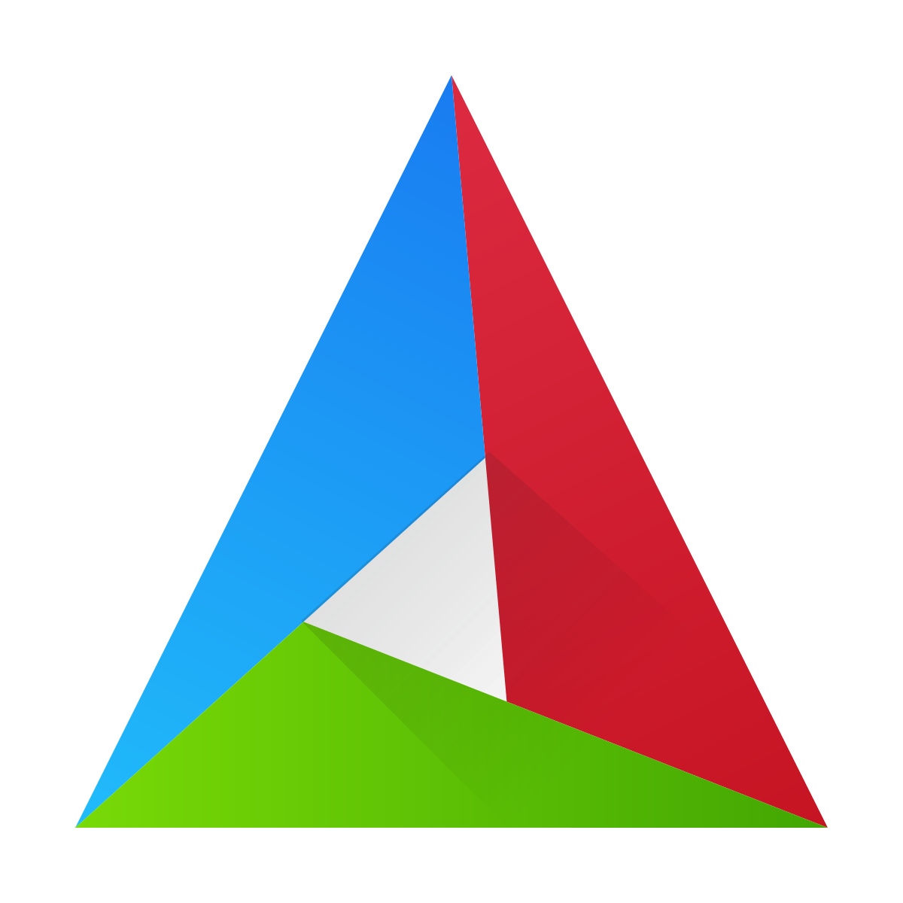
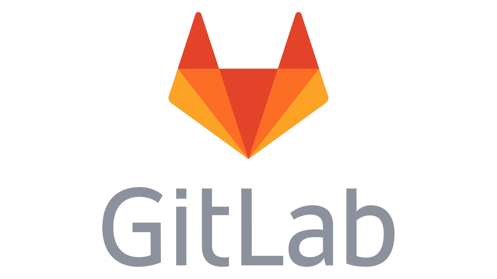
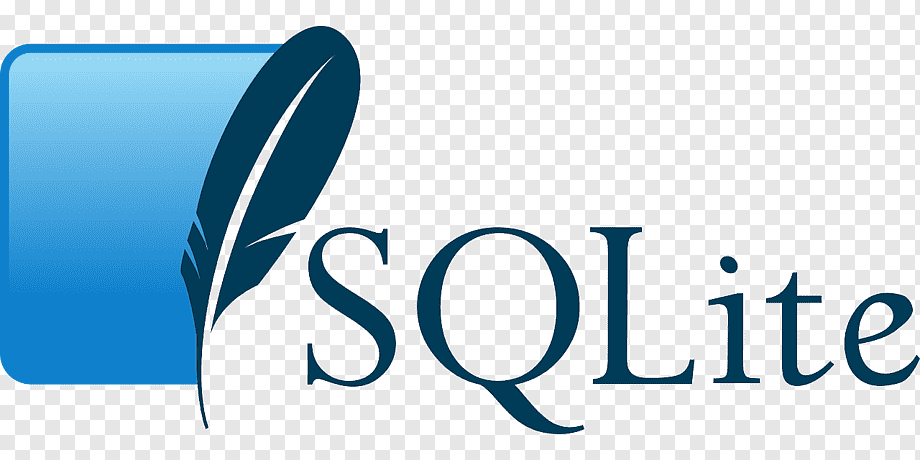

# About
- :wave: Hi, I'm @chemodanovvv @pururum or Anton Chemodanov
- :baby: Started with Backend Dev: C++
- :books: Currently learning Java and Qt Creator
- :hourglass: Also had experience with C#, Python, SQL
- :computer: Completed courses Yandex Practicum "C++ Develop"

  

## You can find me at

 [Telegram](https://t.me/Chemodanovvv)

 [HeadHunter](https://spb.hh.ru/resume/be55e344ff0d085bdc0039ed1f686253397672)

# Stack
         

__C++__: C++17, STL, OOP, algorithm, graphs, protobuf

__C#__: UnityLibrary

## You can see my solutions on platforms such as

 [leetcode](https://leetcode.com/IamAntonion/)

 [codewars](https://www.codewars.com/users/IamAntonion)

<!--
**IamAntonion/IamAntonion** is a ✨ _special_ ✨ repository because its `README.md` (this file) appears on your GitHub profile.

Here are some ideas to get you started:

- 🔭 I’m currently working on ...
- 🌱 I’m currently learning ...
- 👯 I’m looking to collaborate on ...
- 🤔 I’m looking for help with ...
- 💬 Ask me about ...
- 📫 How to reach me: ...
- 😄 Pronouns: ...
- ⚡ Fun fact: ...
-->
